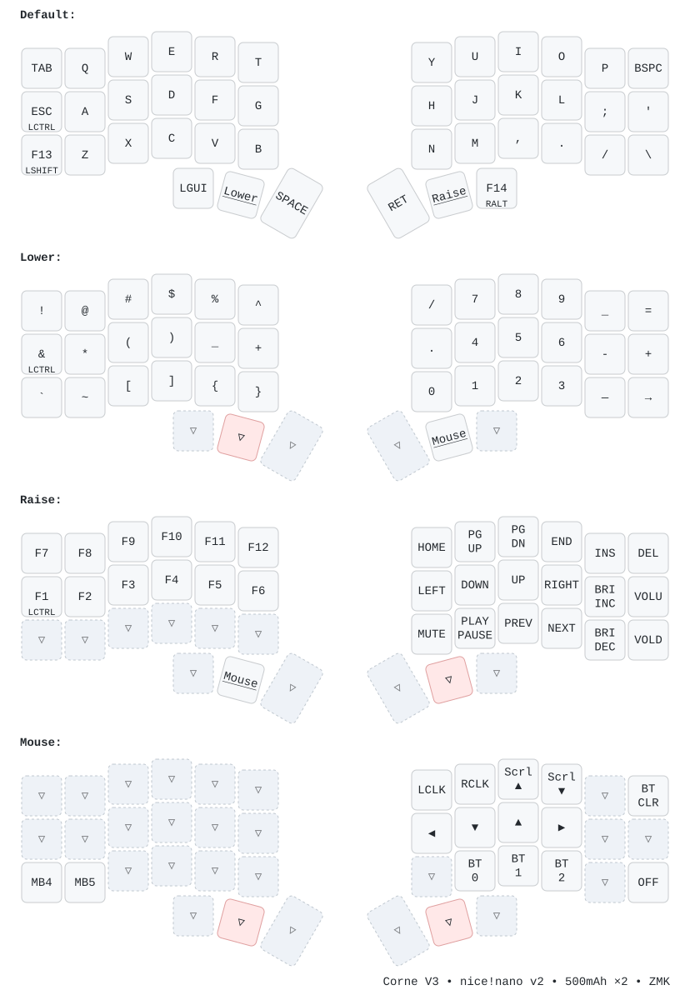

# corne

My daily driver. Corne V3 Choc, wireless, 42 keys. Two nice!nano v2s, ZMK, and a keymap I actually like using.

I killed pin 031 on the left half while soldering, remapped that whole column to 009, and kept going. It has been solid since. 500mAh in each half, no power switch, just `B+` bridged to `RAW`. Lasts days.



> `▽` is transparent. Pink `▽` means that key is holding the layer you are on. Underlined keys in Default are the layer switches. Image switches light/dark with GitHub.

## At a glance

- Corne V3 Choc, 3x6 + 3 thumbs, Kailh Choc Red with low-profile caps
- nice!nano v2, chip down (`nice_nano@2.0.0//zmk`)
- ZMK, 4 layers: Default, Lower, Raise, Mouse
- Batteries: 2x 500mAh, one per half
- Case: 3D printed, local files in `case/` (not tracked)
- Battery check: `tools/corne-battery` (installed locally as `~/.local/bin/corne-battery`) reads both halves over BlueZ and prints `{"left":71,"right":95}`. QuickShell uses it.

Lower is symbols and numbers plus two compose macros (`---` to em dash and `->` to arrow). Raise is F-keys, nav, and media. Mouse is BT switching and mouse keys. That is the whole map. The SVG shows where everything lives.

```bash
tools/corne-battery
# {"left":71,"right":95}
# or, if installed to PATH:
corne-battery
CORNE_MAC=F0_9A_62_B9_46_2E corne-battery   # if your MAC changed after a reset
```

Needs `CONFIG_ZMK_SPLIT_BLE_CENTRAL_BATTERY_LEVEL_PROXY` and `FETCHING` on the left half. Bluetooth leaves the right half at -4 dBm to balance drain.

## Firmware

Built on push to `config/**` or `build.yaml` → Actions → `firmware` artifact. I keep a copy in `firmware/` too.

| Half | UF2 |
| ------ | ----- |
| Left | `corne_left-nice_nano@2.0.0__zmk-zmk.uf2` (col 0 moved to 009) |
| Right | `corne_right-nice_nano@2.0.0__zmk-zmk.uf2` |
| Reset | `settings_reset-nice_nano@2.0.0__zmk-zmk.uf2` |

Chip up `nrfmicro@1.1.0/nrf52840/flipped_zmk` also builds but I do not use it.

Keymap source is `config/corne.keymap`. `keymap_drawer.config.yaml` plus `assets/corne.svg` are the rendered view. It redraws itself on every push via `.github/workflows/draw.yml`.

```bash
# redraw locally
uvx --from keymap-drawer keymap -c keymap_drawer.config.yaml parse -z config/corne.keymap -o assets/corne.yaml
uvx --from keymap-drawer keymap -c keymap_drawer.config.yaml draw assets/corne.yaml -o assets/corne.svg
```

<details>
<summary><strong>Hardware mod — left pin 031 is dead</strong></summary>

031 (pro_micro 21, `P0.31`) shorted to GND. I cut the trace between the 031 pad and the Tab column, then wired the column pad to nano pin 009 (`P0.09`, pro_micro 10). Do not jumper 031 to 009 while 031 is still on the column net, it pulls the column low.

`config/corne_left.overlay` remaps that column. Do not add `config/corne.conf`.

| Role | Pro Micro | nRF | Silkscreen |
| ------ | ----------- | ----- | ------------ |
| Row 0 | 4 | P0.22 | 022 |
| Row 1 | 5 | P0.24 | 024 |
| Row 2 | 6 | P1.00 | 100 |
| Row 3 | 7 | P0.11 | 011 |
| Col Tab/Ctrl/Shift | **10** | P0.09 | **009** |
| Col Q/A/Z | 20 | P0.29 | 029 |
| Col W/S/X | 19 | P0.02 | 002 |
| Col E/D/C | 18 | P1.15 | 115 |
| Col R/F/V | 15 | P1.13 | 113 |
| Col T/G/B | 14 | P1.11 | 111 |

Columns in firmware: `10, 20, 19, 18, 15, 14`. Pin 031 can stay in the header, it is just unused.

Battery is `B+` to `RAW`, no switch. Pull `B+` or `B-` before soldering, tape both if you can. It sits under the PCB cutout, not under the nano.

No switches to test? Short the nano pins with tweezers while plugged into USB: `009+022` is Tab, `029+024` is A.

</details>

<details>
<summary><strong>Flashing (Linux, nice!nano bootloader)</strong></summary>

Drive shows up as `NICENANO`.

```bash
udisksctl mount -b /dev/sda
cp firmware/settings_reset-nice_nano@2.0.0__zmk-zmk.uf2 /run/media/nate/NICENANO/
# wait for it to reappear
cp firmware/corne_left-nice_nano@2.0.0__zmk-zmk.uf2 /run/media/nate/NICENANO/  # or right
sync
```

If the halves drift, flash `settings_reset` on both, then each side's firmware, then turn both on at the same time.

`NICENANO` is the bootloader, not the keyboard. If keys do nothing over USB, check you are not still in bootloader. You should see `ZMK Project Corne Keyboard` in `dmesg`.

</details>

<details>
<summary><strong>Bluetooth pairing</strong></summary>

If `bluetoothctl pair` gives `AuthenticationRejected` or ZMK says `Rejecting pairing request to taken profile 0`, the bond is stale.

Lower plus Tab clears it (`BT_CLR_ALL`).

1. `bluetoothctl remove <MAC>` on the host
2. left half on USB, hold Lower and tap Tab, unplug
3. both halves on battery, wait 10s
4. `bluetoothctl scan on` then `pair F0:9A:62:B9:46:2E` with USB unplugged

Then `corne-battery` should show both sides.

</details>
